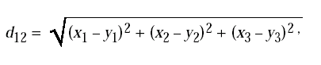

# Notas sobre el codigo de CosmoBologna

Aca voy a ir escribiendo todas las notas sobre el codigo de la libreria CosmoBologna

# VoidCatalogue.cpp

El constructor Catalogue toma varios parametros entre otros los mas importantes.

* `algorithm`: Es un enum que decide si se ejecuta LaZeVo o Exact.
* `tracer_catalogue` y `random_catalogue`: la muestra a analizar y un catalogo de muestas aleatorio respectivamente.
* `cellsize` El tamaño de los bloques. (se utiliza en ChainMesh).
* `n_rec`: numero de reconstrucciones.
* `stepsize`: ???
* `threshold`: valor de convergencia para el algoritmo. (valor para limitar la cantidad de cambios en el algoritmo).

```c++
cbl::catalogue::Catalogue::Catalogue (
    const VoidAlgorithm algorithm,
    Catalogue tracer_catalogue,
    Catalogue random_catalogue,
    const std::string dir_output,
    const std::string output,
    const double cellsize,
    const int n_rec,
    const double step_size,
    const double threshold,
    const std::vector<bool> print)

```

## Primer etapa

Inicializa variables

```c++
const double start_time = omp_get_wtime();
shared_ptr<Catalogue> tracer_cat, random_cat;
vector<Catalogue> displacement_catalogue(n_rec);
vector<vector<unsigned int>> randoms;
cosmology::Cosmology cosm;
CatalogueChainMesh ChainMesh_tracers;
CatalogueChainMesh ChainMesh_randoms;
```

despues inicia la reconstrucción que depende del valor de `algorithm`.

##  Es  `algorithm==VoidAlgorithm::_LaZeVo_`

1. Observa si el `random_catalogue` es vacio, si es asi, genera un nuevo catalogo random uniforme mediante `Catalogue` (linea 81) donde se le pasa como parametro `create_Random_box`. Esta definido en el archivo RandomCatalogue.cpp de la linea 88 a la 118.

Linea 81
```c++
random_catalogue = Catalogue(RandomType::_createRandom_box_, tracer_catalogue, 1., 10, cosm, false, 10., {}, {}, {}, 10, rndd);
```

```c++
Catalogue(
  const RandomType type,
  const Catalogue catalogue,
  const double N_R,
  const int nbin,
  const cosmology::Cosmology &cosm,
  const bool conv,
  const double sigma,
  const std::vector<double> redshift,
  const std::vector<double> RA,
  const std::vector<double> Dec,
  const int z_ndigits,
  const int seed)
```

* `type`: tipo de catálogo random a generar (`_createRandom_box_`, etc.)
* `catalogue`: catálogo original usado como referencia geométrica/distribución
* `N_R`: factor multiplicativo del número de objetos random (`nRandom = N_R * catalogue.nObjects()`).
* `nbin`:número de bins usados en histogramas/distribuciones internas
* `cosm`:objeto cosmológico con parámetros cosmológicos y conversiones
* `conv`:indica si se deben convertir coordenadas/redshift
* `sigma`:parámetro de suavizado o dispersión usado en algunos random catalogues
* `redshift`:vector opcional de redshifts observados
* `RA`:vector opcional de ascensión recta
* `Dec`:vector opcional de declinaciones
* `z_ndigits`:cantidad de dígitos usados para discretizar/redondear redshift
* `seed`:semilla del generador de números aleatorios


2. Si `random_catalogue` tiene distinta cantidad de objetos que `tracer_catalogue` le saca o elimina objetos a `random_catalogue`(linea 96). El metodo que se encarga de esto esta definido en RandomCatalogue.cpp de la linea 694 a la 725.

Linea 96
```c++
random_catalogue.equalize_random_box(tracer_catalogue, rndd);
```

3. Si tienen la misma cantidad no hace nada.

4. Hace dos punteros, uno a el catalogo de random y al de tracer. Define un vector que guardara las indexacion a tracer, y lo llena con valores consecutivos ordenados desde 0 (linea 104).

5. Define 2 ChainMesh, una para el catalogo de random y para el de tracer.

Linea 107
```c++
vector<Var> variables = {Var::_X_, Var::_Y_, Var::_Z_};
	ChainMesh_tracers = CatalogueChainMesh(variables, cellsize, tracer_cat);
	ChainMesh_randoms = CatalogueChainMesh(variables, cellsize, random_cat);
```

```c++
CatalogueChainMesh (
    std::vector<catalogue::Var> variables,
    double cellsize,
    std::shared_ptr<cbl::catalogue::Catalogue> cat,
    std::shared_ptr<cbl::catalogue::Catalogue> cat2)
```

ChainMesh esta definido en CatalogueChainMesh.cpp desdey este toma 4 parametros.
* `variables`: Un set de variables, en este caso son las cordenadas x, y, z.
* `cellsize`: El tamaño de los bloques.
* `cat`: Un catalogo.
* `cat2`: Otro catalogo, en este caso no usamos este parametro.

Basicamente se encarga de construir una estructura donde divide el espacio en celdas y guarda los puntos que estan en ese espacio. En esta estructura tambien se guardan las celdas vecinas a cada celda.

6. Declaro un vector de vectores que va a guardar por cada particula las 113 particulas mas cercanas a cada una.

```c++
 vector<vector<unsigned int>> near_part = ChainMesh_tracers.N_nearest_objects_cat(N_near_obj);
```


# CatalogueChainMesh.cpp

## La clase CatalogueChainMesh

La clase CatalogueChainMesh tiene 5 atributos:

* `m_cellsize`: El tamaño de las celdas.
* `m_lim`: Vector que guarda los limites del catalogo en cada dimension.
* `m_part_catalogue`: Puntero al catalogo en la chain-mesh.
* `m_part_catalogue2`: Puntero al segundo catalogo.
* `m_dimension`: Cantidad de celdas por lado.

## El constructor de CatalogueChainMesh

* `variables`: Un vector del enum Var, este enum contiene distintos tipos de variables, sean coordenadas x, y, z, Redshift, entre otros, en este caso se usan las coordenadas.
* `cellsize`: Es el maximo tamaño de celda que va a tener el grillado cuando se cree.
* `cat`: Un catalogo
* `cat2`: Otro catalogo

```c++
CatalogueChainMesh (
	std::vector<catalogue::Var> variables,
	double cellsize,
	std::shared_ptr<cbl::catalogue::Catalogue> cat, std::shared_ptr<cbl::catalogue::Catalogue> cat2)
```

### Construccion

1. Inicializa variables

```c++
m_part_catalogue = cat;
m_part_catalogue2 = cat2;
unsigned int nDim=variables.size();
vector<vector<double>> data(nDim);
for (size_t i=0; i<nDim; i++) data[i] = m_part_catalogue->var(variables[i]);
vector<vector<double>> data2={};
if (m_part_catalogue2!=NULL) {
	data2.resize(nDim, vector<double>(m_part_catalogue2->var(variables[0])));
	for (size_t i=0; i<nDim; i++) data2[i] = m_part_catalogue2->var(variables[i]);
}
```

data va a ser un vector donde va a guardar toda la informacion de cada una de las coordenadas

2. Continua buscando en cada variable su valor maximo y minimo y lo guarda en `m_lim`. Tambien lo hace en el segundo catalogo si fue dado.

```c++
vector<unsigned int> num_cells(nDim);
vector<double> delta(nDim);
double start_cellsize = cellsize;
m_lim.resize(nDim);
for (size_t i=0; i<nDim; i++) {
	m_lim[i].resize(2);
	m_lim[i][0] = *min_element(data[i].begin(), data[i].end());
	m_lim[i][0] = (m_part_catalogue2!=NULL) ? min(m_lim[i][0], *min_element(data2[i].begin(), data2[i].end()))-0.05*cellsize :  m_lim[i][0]-0.05*cellsize;
	m_lim[i][1] = *max_element(data[i].begin(), data[i].end());
	m_lim[i][1] = (m_part_catalogue2!=NULL) ? max(m_lim[i][1], *max_element(data2[i].begin(), data2[i].end()))+0.05*cellsize :  m_lim[i][1]+0.05*cellsize;
	delta[i] = m_lim[i][1]-m_lim[i][0];
}
```

En delta se guarda el diferencial entre los puntos mas alejados en esa dimension.

3. Comienza a definir el tamaño de las celdas en funcion a la dimension mas grande, osea con las particulas mas alejadas. Voy dividiendo esta dimesion hasta conseguir un tamaño de celda menor o igual al de `cellsize` que pasamos como parametro.

```c++
unsigned int nCells=0;
double delta_max = *max_element(delta.begin(),delta.end());
cellsize = delta_max;
vector<vector<unsigned int>> cells(1);

while(cellsize > start_cellsize) {
	nCells++;
	cellsize = delta_max/nCells;
	cells.resize((int)pow(nCells, nDim));
}
```

Y luego se guarda como atributo de la clase el `nCells` y `cellsize` nuevo.

4. Se calcula un index para cada celda. Y guarda en el vector `cells` la respectiva celda.

```c++
  for (unsigned int i=0; i<data[0].size(); i++) {
    unsigned int index=0;
    for (unsigned int j=0; j<nDim; j++) index += ((unsigned int)((data[j][i] - m_lim[j][0])/cellsize))*pow(nCells,nDim-j-1);
    cells[index].emplace_back(i);
  }
```

Se normaliza cada componente con el minimo de cada dimension y luego se componen utilizando potencias de `nCells`.


5. Para cada celda creo un vector `nearcells` donde calcula la distancia con cada una de las otras celdas. El index de `nearcells` va a indicar que tan lejos se encuentra la celda.

```c++
  for (size_t i=0; i<cells.size(); i++) {
    vector<vector<unsigned int>> nearCells(dim_nearCells);
    for (size_t j=0; j<cells.size(); j++) {
      double sum = 0;
      unsigned int index1 = i, index2 = j;
      for (unsigned int k=0; k<nDim; k++) {
        double temp_dist = (double)(index1%nCells)-(double)(index2%nCells);
        if ((int)temp_dist != 0) temp_dist -= 0.5;
        sum += temp_dist*temp_dist;
        index1 = (int)(index1/nCells);
        index2 = (int)(index2/nCells);
      }
      nearCells[(int)sqrt(sum)].emplace_back(j);
    }
    check_memory(8.0, true, "cbl::catalogue::Catalogue::Catalogue of ChainMeshCatalogue.cpp. Increase cellsize");
    add_object(move(Object::Create(i, cells[i], nearCells)));
  }
```
La distancia se calculca reconstruyendo cada componente de la cordenada a partir de los index. Como sabemos el index esta construido en base a `nCells` por lo tanto, calcula el modulo de los index con `nCells` y obtiene el valor de cada componente, resta los valores dados de la componente de cada indice, luego lo eleva al cuadrado y lo suma con el resto de de cuadrados de las diferencias de componentes. Para obtener las otras componentes lo que hace es divid el index con `nCells` y repetir el proceso anteriormente descrito hasta hacerlo con todas las dimensiones. Una vez realizado todos los calculos con todas las componentes se calcula la raiz cuadrada de la suma y esto dara con la distancia entre las celdas, y segun esta distancia se guarda en `nearCells`.



## Funcion N_nearest_objects


